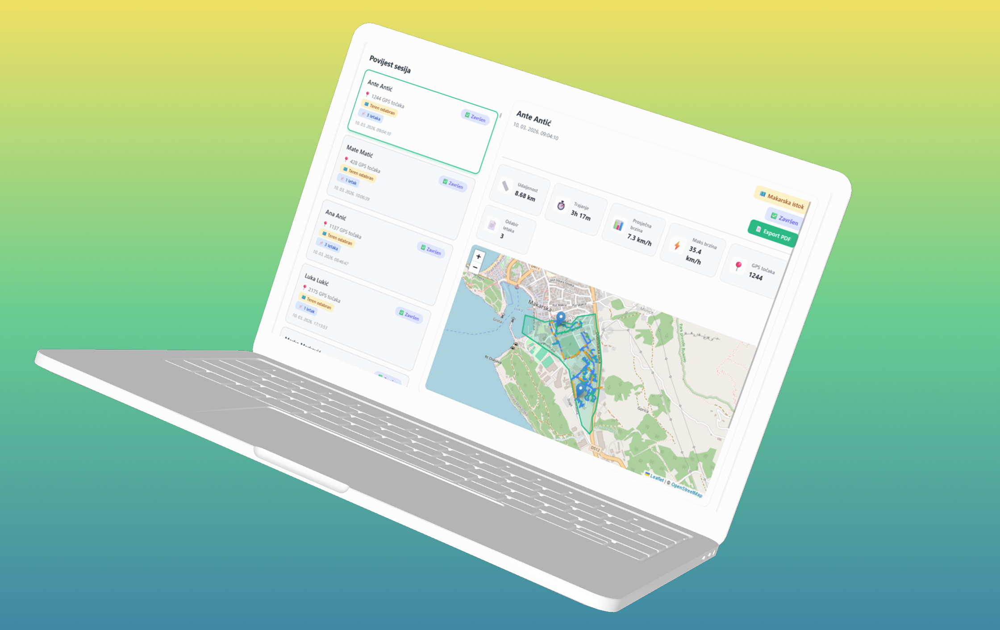

# Prizma Tracking Admin Portal

Real-time GPS tracking admin portal for field worker management, built with React, TypeScript, and Firebase.

---

## Features

- **Live Tracking** — real-time worker positions on an interactive map
- **Session History** — filter sessions by worker, territory, status, and date range
- **Speed Visualization** — color-coded route segments based on movement speed
- **Territory Management** — KML-based territory overlays on the map
- **PDF/Excel Export** — export completed session routes and data
- **Responsive Design** — desktop, tablet, and mobile support

---

## Tech Stack

- **Frontend:** React 18, TypeScript, Vite
- **Database:** Firebase Firestore & Auth
- **Maps:** Leaflet
- **Styling:** CSS Modules
- **Hosting:** Vercel

---

## Getting Started

### Prerequisites
- Node.js
- Firebase project

## Related

- [Prizma Tracker App](https://github.com/VujevicStipe/prizma-tracker-app) — React Native Android app

---

## License

Proprietary — Prizma Distribucija